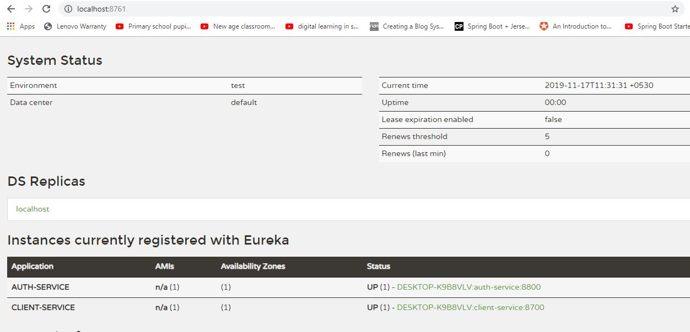

# MicroServiceWithSpringCloudGateway
This is a sample application to create and demonstrate the micro-service architecture with spring cloud gateway, eureka server, 
eureka client, ribbon and feign.

Eureka server 

Call client service Rest API via API gateway using Postman

